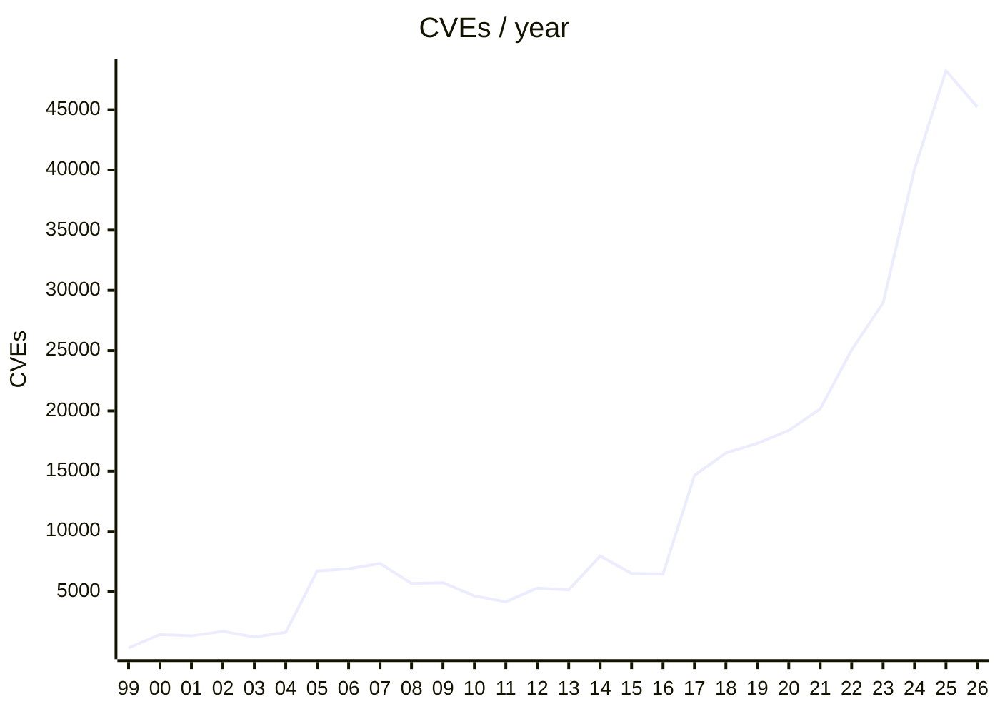

---
# You can also start simply with 'default'
theme: seriph
# random image from a curated Unsplash collection by Anthony
# like them? see https://unsplash.com/collections/94734566/slidev
background: warehouse.jpg
# some information about your slides (markdown enabled)
title: Longue vie à la chaîne d'approvisionnement!
info: |
  ## Slidev Starter Template
  Presentation slides for developers.

  Learn more at [Sli.dev](https://sli.dev)
# apply unocss classes to the current slide
class: text-center
# https://sli.dev/features/drawing
drawings:
  persist: false
hideInToc: true
# slide transition: https://sli.dev/guide/animations.html#slide-transitions
transition: none
# enable MDC Syntax: https://sli.dev/features/mdc
mdc: true
# open graph
# seoMeta:
#  ogImage: https://cover.sli.dev
---

# Longue vie à la chaîne d'approvisionnement!

Photo by <a href="https://unsplash.com/@sulyok_imaging?utm_source=unsplash&utm_medium=referral&utm_content=creditCopyText">Adrian Sulyok</a> on <a href="https://unsplash.com/photos/yellow-and-white-plastic-box-lot-sczNLg6rrhQ?utm_source=unsplash&utm_medium=referral&utm_content=creditCopyText">Unsplash</a> / <a href="https://www.sulyokimaging.ro">https://www.sulyokimaging.ro</a>

---
hideInToc: true
image: gab.jpg
layout: image-left
---

# $ `whoami`

- DevSecOps
- ~400 deploys/jour / 15 devs
- 3 ans en sécurité temps plein
  - 2 ans automatisation des réponses aux menaces cyber
  - 1 an cryptographie

---
image: sleep.jpg
layout: image-right
level: 2
---

# <3 Supply Chain

- `unattended-upgrades` @ 0400 local
- `renovate-bot` (oss) @ 00:00 - 08:00 local
- `renovate-bot` (internal) @ 08:00 - 18:00 local

  Photo by <a href="https://unsplash.com/@davidclode?utm_source=unsplash&utm_medium=referral&utm_content=creditCopyText">David Clode</a> on <a href="https://unsplash.com/photos/koala-bear-sleeping-on-tree-Yg_sNKOiXvY?utm_source=unsplash&utm_medium=referral&utm_content=creditCopyText">Unsplash</a>
      

---
hideInToc: true
---

# ToC

<Toc minDepth="1" maxDepth="1" />

---
layout: image-right
image: beer.jpg
---

# Avertissements

- Mes opinions sont les miens
  - Et n'engagent que moi
- N'hésitez pas à poser des questions
  - Pour les questions plus avancées/pointues, il y aura  la bière!

Photo by <a href="https://unsplash.com/@barncreative?utm_source=unsplash&utm_medium=referral&utm_content=creditCopyText">Fábio  Alves</a> on <a href="https://unsplash.com/photos/beer-dispensers-_fLgxjACz5k?utm_source=unsplash&utm_medium=referral&utm_content=creditCopyText">Unsplash</a>

---
layout: two-cols
level: 2
---

# Damned if you do

- SolarWinds (2020)
- CodeCov (2021)
- Comm100 (2022)
- MOVEit (2023)
- Crowdstrike (2024)
- Shai-Hulud (2025)
- PostHog/LiteLLM (2026)

(Liste Très  Non Exhaustive!)

::right::

<v-click>

# Damned if you don't

</v-click>

---
level: 2
---

# Pause Lexicale

- CVE: Common Vulnerabilities & Exposures

- CVSS: Common Vulnerability Scoring System (0 - 10.0)

<v-click>

- EPSS: Exploit Prediction Scoring System (0 - 1)

</v-click>

---
hideInToc: true
layout: section
---

# Supply Chain Attacks

---
src: slides/solarwinds.md
---

---
src: slides/dependency-confusion.md
---

---
src: slides/quix-.md
---

---
layout: section
---

# Défences

---
layout: section
---

# Défences ()

---
hideInToc: true
layout: section
---

# Moindre Privilège

## ✅ Je ne peux pas attaquer un _repo_ sans accès en écriture (*)

(*) Nonobstant une élévation de privilèges au cours d'une attaque

---
src: slides/authentication.md
---

---
src: slides/insider.md
---

---
src: slides/conclusion.md
---

---
layout: end
class: text-center
---

# Questions?

# Commentaires?

# Insultes?

<PoweredBySlidev mt-10 />

---
src: slides/conclusion.md
---
