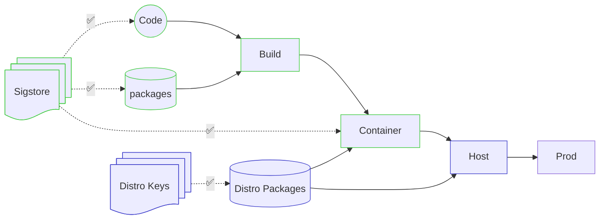

# Signatures Cryptographiques

---
layout: two-cols-header
level: 2
---

# Signatures Cryptographiques

::left::

## Triples Garanties

- Intégrité
- Authenticité
- Non-Répudiation

::right::

Image Source: [Bank of Canada](https://www.bankofcanada.ca/banknotes/bank-note-series/frontiers/100-polymer-note/)

<!--
Authenticité: The Author is who they claim to be
Intégrité: The document wasn't altered
Non-Répudiation: There is exactly one author and we can positively identify them. If they want to claim there was fraud, they have the duty to prove how someone could compromise the algorithms to be considered as them.
-->

---
level: 2
---

# Git Commit Signing: Validation

---
level: 2
---

# ToC ⚖️ ToU

- La clé privée est encryptée avec un mot/phrase de passe
- GPG-Agent décrypte la clé pour une période (par défaut: 10 minutes)

---
layout: section
level: 3
---

# [Sequoia-Git](https://gitlab.com/sequoia-pgp/sequoia-git)

`sudo apt install sequoia-git`  
`sq-git init`

➕ Le code contient les clés publiques

➖ Difficile à gérer en large déploiement

---
level: 2
---

> Tu m'a convaincu! À partir de maintenant, je signe tout!

<v-click>
Ils vécurent heureux et n'eurent pas beaucoup d'incidents...
</v-click>

<v-click>
N'est-ce pas?
</v-click>

---
level: 2
---

# On est juste à la moitié du chemin!

Les mécanismes de validation à la consommation des packages sont encore manquants!

(Sauf pour les packages des OS)
