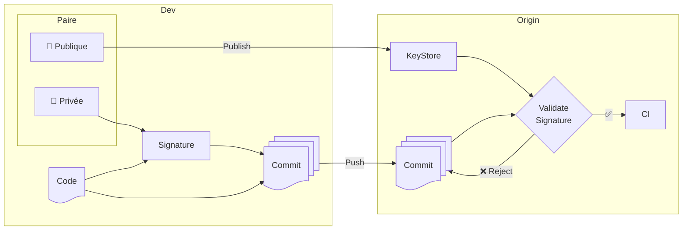

# Dance Like Nobody's Watching

# Encrypt Like Everyobdy Is

- Dr Werner Vogels, Amazon CTO

---
layout: section
---

# Code Like Nobody's Watching

# Authenticate Like Everybody Is

---
layout: two-cols-header
level: 2
---

# Signatures Cryptographiques

::left::

## Triples Garanties

- Intégrité
- Authenticité
- Non-Répudiation

::right::

Source: [Bank of Canada](https://www.bankofcanada.ca/banknotes/bank-note-series/frontiers/100-polymer-note/)

<!--
Authenticité: The Author is who they claim to be
Intégrité: The document wasn't altered
Non-Répudiation: There is exactly one author and we can positively identify them. If they want to claim there was fraud, they have the duty to prove how someone could compromise the algorithms to be considered as them.
-->

---

# Validation

---

# ToC ⚖️ ToU

- La clé privée est encryptée avec un mot/phrase de passe
- GPG-Agent décrypte la clé pour une période de 10 minutes (par défaut)

---
layout: section
level: 3
---

# [Sequoia-Git](https://gitlab.com/sequoia-pgp/sequoia-git)

`sudo apt install sequoia-git`  
`sq-git init`
