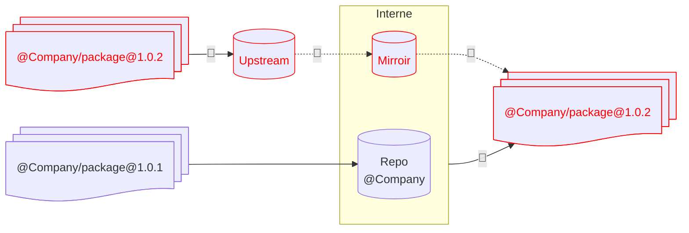

# Dependency Confusion

---
level: 3
---

# Dependency Confusion

```mermaid
flowchart LR


U@{label: Upstream, shape: db}
subgraph Interne
    R@{label: Repo<br/>@Company, shape: db}
    M@{label: Mirroir, shape: db}
end
U-.->M

P@{label: "@Company/package@1.0.1", shape: docs} --->R

Interne --> O@{label: "@Company/package@1.0.1", shape: docs}
R -.->O
SI@{label: "@slidev/cli@52", shape: docs} --> U
Interne --> SO@{label: "@slidev/cli@52", shape: docs}
M -.-> SO
```

---
level: 3
---

# Dependency Confusion

```mermaid
flowchart LR


U@{label: Upstream, shape: db}
subgraph Interne
    R@{label: Repo<br/>@Company, shape: db}
    M@{label: Mirroir, shape: db}
end
U-.->|🦠|M

P@{label: "@Company/package@1.0.1", shape: docs} --->R
Ma@{label: "@Company/package@1.0.2", shape: docs} -->|🦠| U

Interne -->|🦠| O@{label: "@Company/package@1.0.2", shape: docs}
M -.->|🦠| O

classDef pwnt color:red,stroke:red;
class M,Ma,O,U pwnt;
```

