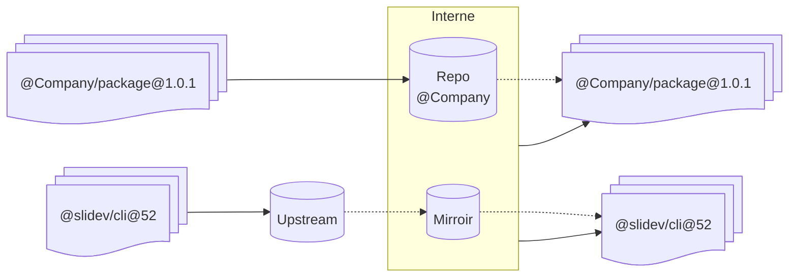
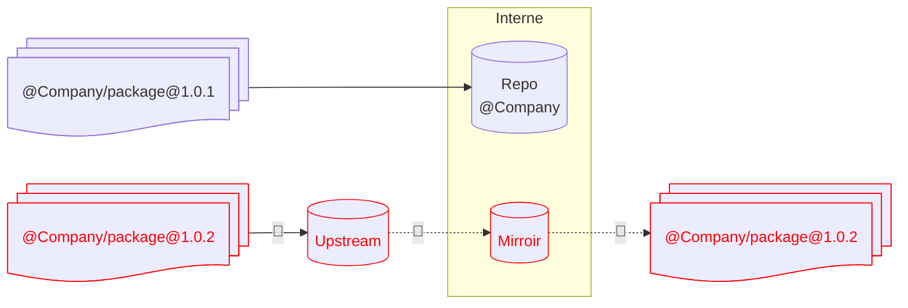

# Dependency Confusion

---
level: 2
---

# Dependency Confusion



---
level: 2
---

# Dependency Confusion



---
layout: two-cols-header
level: 2
---

# Mitigations

::left::

-  Réserver le `@scope` publiquement
    + Restreint qui peut publier
    - Fuite de l'information interne
    - Pas une garantie dans le temps
        - Fiasco NPM/Kix/Left-Pad

::right::

<v-click>

- Déconnecter les packages privés des sources publiques

```diff
packages:
  '@my-company/*':
    access: $all
    publish: $authenticated
    unpublish: $authenticated
-   proxy: npmjs
  '@*/*':
    access: $all
    proxy: npmjs
  '**':
    access: $all
    proxy: npmjs
```

Référence:  [Verdaccio Docs](https://www.verdaccio.org/docs/best/#remove-proxy-to-increase-security-at-private-packages)

</v-click>
