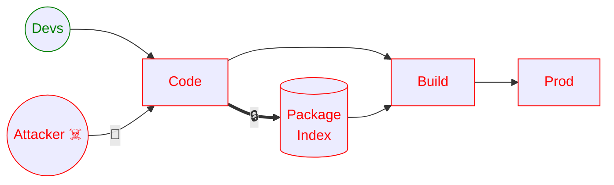

# L'éternel jeu du chat et de la souris...

<center>


</center>

---
layout: section
---

# Les attaques via Git(Hub)

### PostHog (SHA1-Hulud 2.0)
### AquaSecurity (Trivy ... & LiteLLM)

---
level: 2
---

# Initial Vector: Identifiants Compromis

- Fuite Précédente?
- Phishing?

---
level: 2
---

# Initial Vector: Pull Request Malicieux

<ul>
  <li v-click>Forker le projet</li>
  <li v-click>Créer un payload d'exfiltration de secret</li>
  <li v-click>L'injecter dans une config de pipeline</li>
  <li v-click>Créer un PR <em>upstream</em></li>
  <li v-click>Actions Actionnent</li>
  <li v-click>Secrets!</li>
  <li v-click>Supprimer le PR et la branche
    <ul><li>Points bonis si les actions le font</li></ul>
  </li>
</ul>

---
level: 2
---

# Root Cause pt1: Fork Pull Request Approvals

GitHub > Project > Settings > Actions > General


---
layout: two-cols-header
level: 2
---

# Root Cause pt2: `on: pull_request_target`

::left::

Le pipeline teste le code de la branche de l'attaquant

::right::

Le pipeline s'exécute comme si le code avait déjà été mergé dans la branche (ex: main)

::bottom::

`on: pull_request_target` est un signe que quelqu'un essaie d'utiliser les pipelines pour faire quelque chose que le CI ne devrait pas faire...

---
layout: two-cols-header
level: 2
---

# aquasecurity/trivy-action

19-20 mars

::left::

- ~17:43 UTC: Réécriture de l'historique git et 83 tags de versions sur 2 actions

```yaml
uses: aquasecurity/trivy-action@v6.6.6
```

- ~20:38 UTC: L'attaque est contenue. Les versions malicieuses sont révoquées


::right::

<V-Click>

C'est aussi pourquoi tous vos outils de sécurité ont soudainement sévi et insisté que vos GitHub Actions soient associés à un commit spécifiquement

</V-Click>
