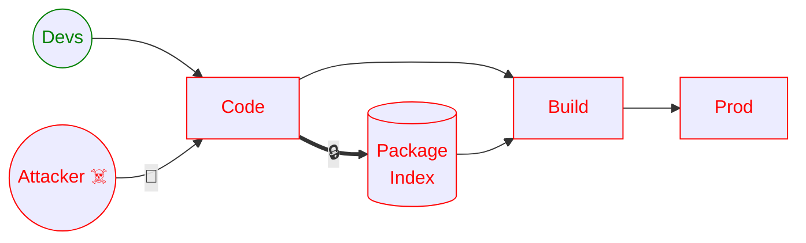

# L'éternel jeu du chat et de la souris...

---
layout: section
---

# Les attaques via Git(Hub)

---
level: 2
---

# Initial Vector: Identifiants Compromis

- Fuite Précédente?
- Phishing?

---
level: 2
---

# Initial Vector: Pull Request Malicieux

<ul>
  <li v-click>Forker le projet</li>
  <li v-click>Créer un payload d'exfiltration de secret</li>
  <li v-click>L'injecter dans une config de pipeline</li>
  <li v-click>Créer un PR `upstream`</li>
  <li v-click>Actions Actionnent</li>
  <li v-click>Secrets!</li>
  <li v-click>Supprimer le PR et la branche
    <ul><li>Points bonis si les actions le font</li></ul>
  </li>
</ul>

---
level: 2
---

# Root Cause pt1: Fork Pull Request Approvals

GitHub > Project > Settings > Actions > General

---
layout: two-cols-header
level: 2
---

# Root Cause pt2: `on: pull_request_target`

::left::

Le pipeline teste le code de la branche de l'attaquant

::right::

Le pipeline s'exécute comme si le code avait déjà été mergé dans la branche (ex: main)

---
layout: two-cols-header
level: 2
---

# Déjà vu?

::left::

## PostHog

### (Sha1-Hulud 2.0)

::right::

## Trivy

::bottom::

Et ce ne sont pas les seuls!

