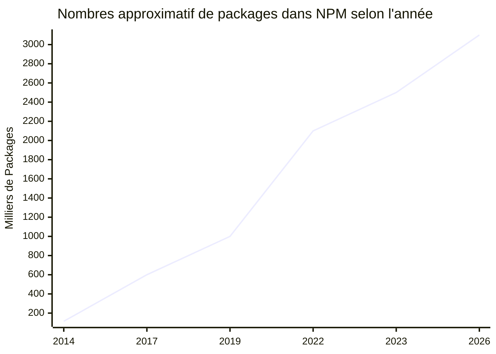
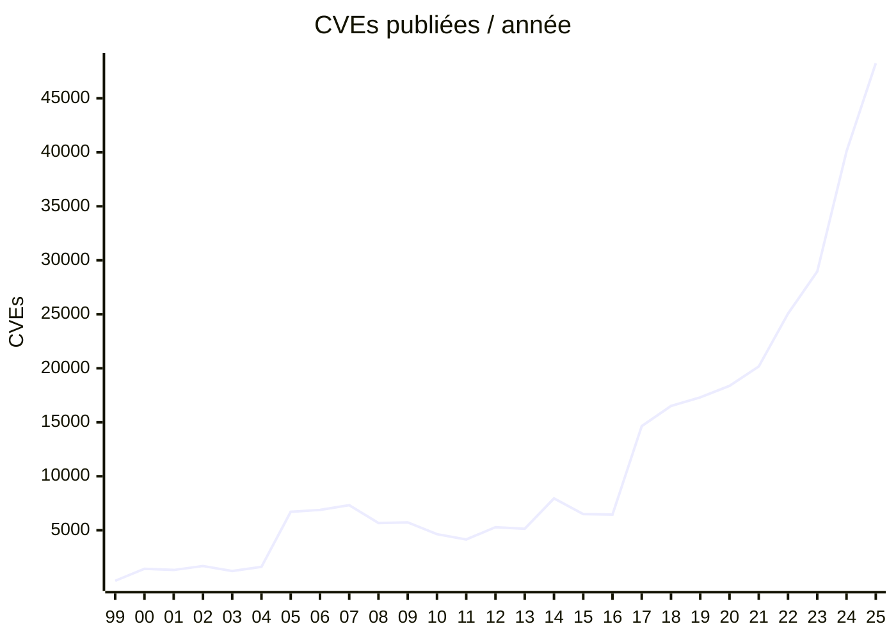

# Pourquoi utiliser la chaîne d'approvisionnement?

::left::

- Native à chaque écosystème
- Simple!
- Permet de ne pas réinventer la roue!

::right::

Source: Gemini. Prenez ça avec un peu de 🧂

---
layout: two-cols-header
level: 2
---

# Mais, j'ai entendu qu'on peut m'attaquer par là?!?

::left::

## Oui...

- SolarWinds (2020)
- CodeCov (2021)
- Comm100 (2022)
- MOVEit (2023)
- Crowdstrike (2024)
- Shai-Hulud (2025)
- PostHog/LiteLLM (2026)
- Mini Shai-Hulud/Miasma (2026)

(Liste Très  Non Exhaustive!)

::right::

<v-click>

## Stagner est pire...

</v-click>

---
level: 2
---

# Pause Lexicale

| Acronyme | Définition                          | Échelle    | ex: Log4J                  |
|----------|-------------------------------------|------------|----------------------------|
| CVE      | Common Vulnerabilities & Exposures  |            | CVE-2021-44228 (Log4Shell) |
| CVSS     | Common Vulnerability Scoring System | 0 - 10     | 10.0                       |
| EPSS     | Exploit Prediction Scoring System   | 0 - 100%   | 100 % (À Posteriori)       |
| KEV      | Known Exploited Vulnerability       |            | Oui. 0-Day                 |
