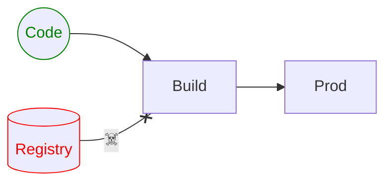
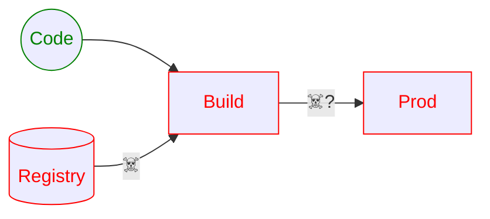
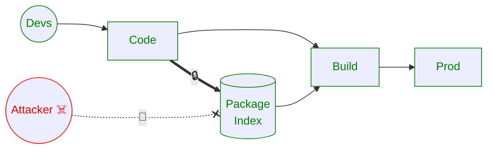

# `Qix-` Account Takeover

## La plus grosse _supply chain attack_ de l'histoire

---
layout: center
level: 2
---

# Initial Vector

## Phishing 🎣

---
backgroundSize: contain
image: /phish.png
hideInToc: true
layout: image
---

<div class="abs-b">🎣</div>
<div class="abs-br">🎣</div>

<arrow v-click="[1,2]" x1="650" y1="35" x2="425" y2="35" color="#C44" width="2" arrowSize="1" />
<arrow v-click="[2,]" x1="100" y1="58" x2="250" y2="58" color="#C44" width="2" arrowSize="1" />
<arrow v-click="[2,]" x1="800" y1="600" x2="600" y2="358" color="#C44" width="2" arrowSize="1" />
<div class="abs-b">Source: <a href="https://www.aikido.dev/blog/npm-debug-and-chalk-packages-compromised">https://www.aikido.dev/blog/npm-debug-and-chalk-packages-compromised</a></div>


---
level: 2
---

# Chronologie

8 septembre

- 2:50 am: Email Envoyé
- 9:00 am: `Qix-` pwnt
- 9:16 am: Aikido détecte l'attaque
- GHSAs/CVEs publiés
- `npm audit` bloque le monde

~ 50 packages attaqués

\> 2G Downloads/semaine visés

---
level: 2
---

# Payload: CryptoStealer

- Exécuté dans le navigateur des utilisateurs lorsqu'emballé dans la distribution
- Intercepte les transactions en cryptomonaies et interactions web3
- Redirige les paiments en cryptomonaies vers des addresses contrôlées par l'attaquant

---
level: 2
---

# Attack ... ??? ... Profit ?

💸


---
level: 2
---

# Python?

## [PyPI Acceptable Use Policy](https://policies.python.org/pypi.org/Acceptable-Use-Policy/)

> That resource is only effective when our users are able to work together as part of a community in good faith.

<v-click>
<center>

](/public/duty-calls.png)

Image: XKCD

</center>
</v-click>

---
level: 2
---

# Python?

## [PyPI Acceptable Use Policy (Extrait)](https://policies.python.org/pypi.org/Acceptable-Use-Policy/)

> We do not allow content or activity on PyPI that:
> - automated excessive bulk activity and coordinated inauthentic activity, such as
>     - spamming
>     - cryptocurrency mining;
> - bulk distribution of promotions and advertising prohibited by PyPI terms and policies;
> - inauthentic interactions, such as fake accounts and automated inauthentic activity;
> - uses obfuscation techniques to hide or mask functionality;
> - using PyPI as a platform for propagating abuse on other platforms;
> - using our servers for any form of excessive automated bulk activity, to place undue burden on our servers through automated means, or to relay any form of unsolicited advertising or solicitation through our servers, such as get-rich-quick schemes.

---
level: 2
---

# Python?

## [PyPI Acceptable Use Policy (Extrait)](https://policies.python.org/pypi.org/Acceptable-Use-Policy/)

> #### Active Malware or Exploits
>
> Being part of a community includes not taking advantage of other members of the community. We do not allow anyone to use our platform in direct support of unlawful attacks that cause technical harms, such as using PyPI as a means to deliver malicious executables or as attack infrastructure, for example by organizing denial of service attacks or managing command and control servers.

---
level: 2
---

# Python TL;DR

## [PyPI Acceptable Use Policy](https://policies.python.org/pypi.org/Acceptable-Use-Policy/)

### Les packages malicieux seront retirés (_yanked_)

<v-click><h4>Mais pas avant d'être publiés!</h4></v-click>

---
layout: two-cols-header
level: 2
---

# Prévention

<center>




</center>

::left::

- Via _Registries_ Publics
- Ou un Mirroir Privé

::right::

- `npm audit`
- `npx better-npm-audit`
- `pip-audit`
- `uv-audit`


---
level: 2
---

# Supply Chain: A-t-on été assez vite?

<center>


</center>

---
level: 3
---

# OWASP Dependency-Track


source: https://owasp.org/www-project-dependency-track/

---
lahyout: section
level: 2
---

# Package Integrity / Provenance

[Example: Sigstore-JS](https://www.npmjs.com/package/sigstore#provenance)


Source: https://github.blog/security/supply-chain-security/introducing-npm-package-provenance/

---
level: 2
---

# Trusted Publishing

- Remplace les secrets à durée de vie indéterminée
  - Short-Lived OIDC Tokens (15 minutes)
- Permet de désactiver les tokens traditionnels (NPM)
- Permet 2FA à la publication
- CI/CDs supportés:
    - ActiveState
    - GitHub Actions
    - GitLab CI
    - Google Cloud

Référence: https://docs.pypi.org/trusted-publishers/

---
level: 2
---

# Trusted Publishing

```diff
jobs:
  pypi-publish:
    name: upload release to PyPI
    runs-on: ubuntu-latest
+    # Specifying a GitHub environment is optional, but strongly encouraged
+    environment: pypi
+    permissions:
+      # IMPORTANT: this permission is mandatory for Trusted Publishing
+      id-token: write
    steps:
      # retrieve your distributions here

      - name: Publish package distributions to PyPI
        uses: pypa/gh-action-pypi-publish@release/v1
-        with:
-          username: __token__
-          password: ${{ secrets.PYPI_TOKEN }}
```

Source: https://docs.pypi.org/trusted-publishers/using-a-publisher/

---
layout: section
level: 3
---

# Digital Attestations ([PEP-740](https://peps.python.org/pep-0740/))

> TL;DR: An attestation will tell you **where** a PyPI package came from, but not **whether** you should trust it.

<div class="abs-b"><p>Source: https://docs.pypi.org/attestations/security-model/#trustworthiness</p>></div>

---
level: 3
---

# Recap

<center>


</center>

<center>
    <v-click>
        <em>Ils vécurent heureux et eurent beaucoup de clients?</em>
    </v-click>
</center>
