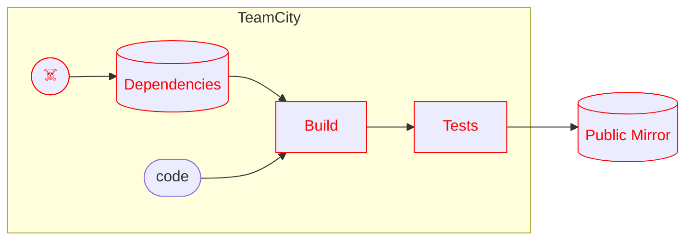
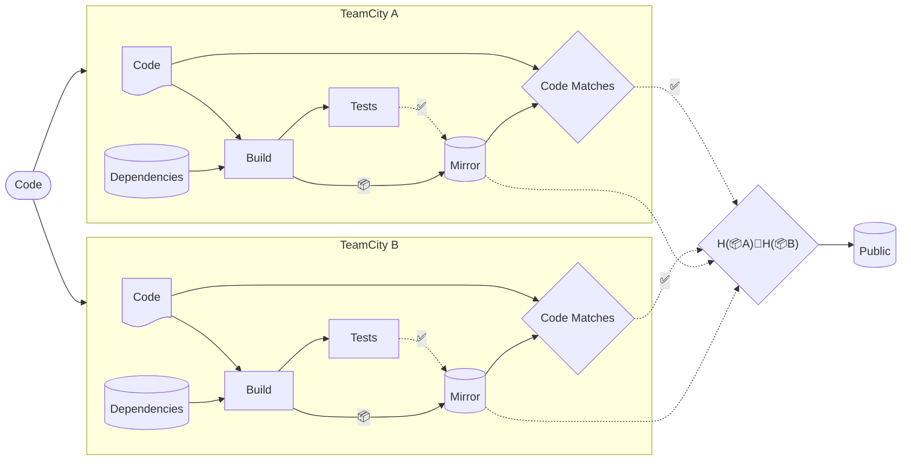
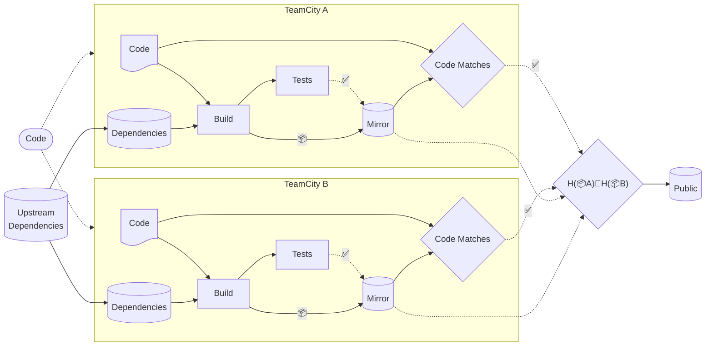

# SolarWinds SUNBURST (2020)

## CI/CD Compromis

---
level: 2
---

# Initial Vector

- ⁉️ Incertain ⁉️
    - Authentifiants Compromis
    - _Password Spraying_
    - _Social Engineering_

---
level: 2
---

# L'attaque

---
level: 2
---

# M'auront pas \[deux fois\], ces ...

---

# Bon, mais pas parfait

